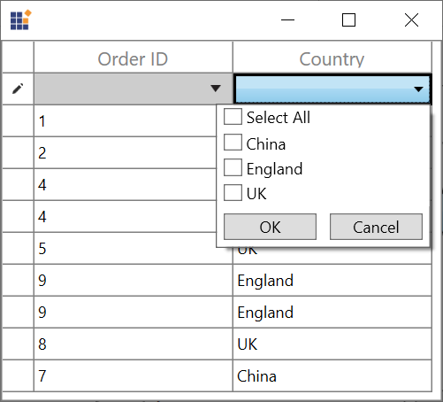

# How to Order the GridMultiColumnDropDownList Column FilterRow Items in WPF DataGrid?

This sample show cases how to order the GridMultiColumnDropDownList column FilterRow items in [WPF DataGrid](https://www.syncfusion.com/wpf-controls/datagrid) (SfDataGrid).

The ComboBox for FilterRow will be loaded with items based on the records order in the `DataGrid`. In order to sort the items in `ComboBox` of FilterRow, CustomCellRenderer can be derived from the `GridFilterRowMultiSelectRenderer` and adding the custom renderer to the grid.

``` csharp
public class GridMultiSelectComboBoxRendererExt : GridFilterRowMultiSelectRenderer
{
    public GridMultiSelectComboBoxRendererExt() : base()
    {
    }
 
    public override void OnInitializeEditElement(DataColumnBase dataColumn, ComboBoxAdv uiElement, object dataContext)
    {
        //To sort the items while the DropDown for filter cell is initialized.
        base.OnInitializeEditElement(dataColumn, uiElement, dataContext);
        SortDescription sd = new SortDescription("DisplayText", ListSortDirection.Ascending);
        uiElement.Items.SortDescriptions.Add(sd);
    }
}
```

``` csharp
//Remove the existing renderer
Grid.FilterRowCellRenderers.Remove("MultiSelectComboBox");
//Add the customized renderer
Grid.FilterRowCellRenderers.Add("MultiSelectComboBox", new GridMultiSelectComboBoxRendererExt());
```


